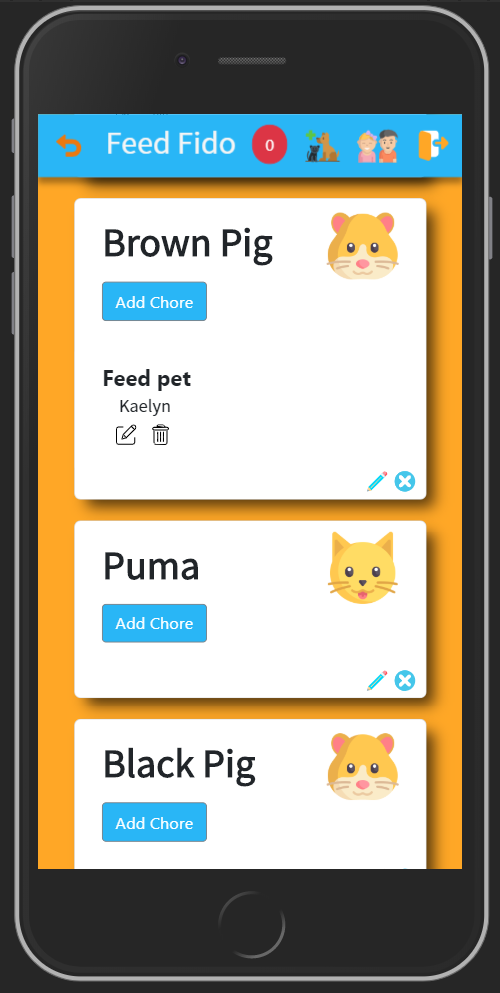
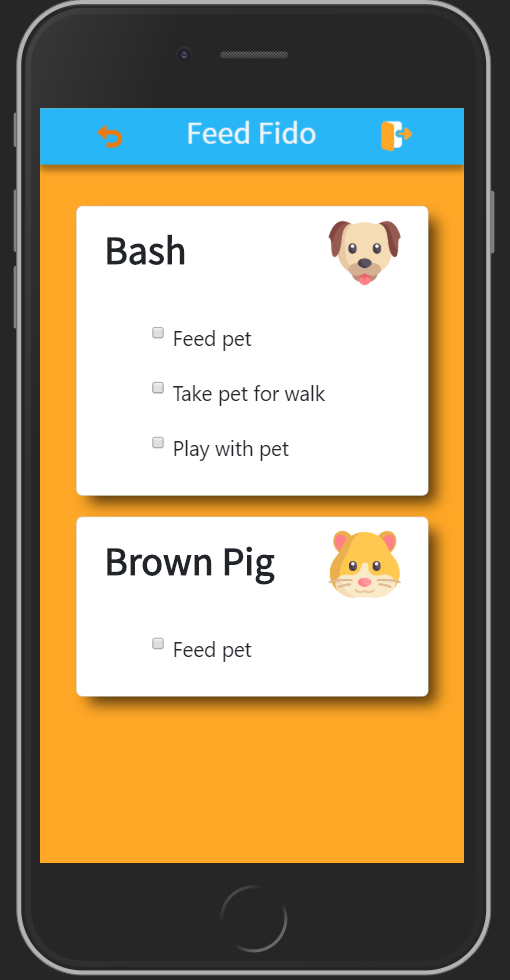
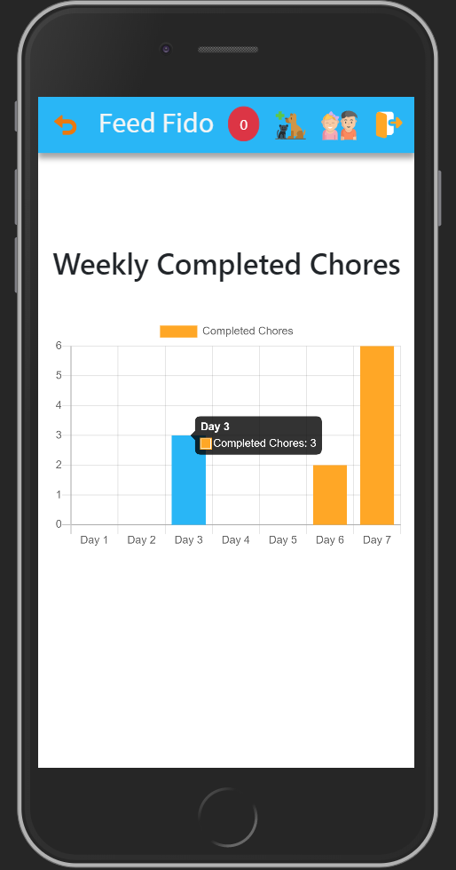

# Feed Fido

Feed Fido is a React web app with full CRUD functionality that allows parent users to assign and track pet care chores assigned to child users.  It offers a mobile-friendly design for both parent and child users as well as a simplified user experience for child users.  

Parent users have the ability to add single or recurring pet chores and assign those chores to a child.  Chores can be edited and deleted.  Parent users have the ability to add pets and child users to their accounts as well as edit and delete them.  Parent users receive notifications about uncompleted chores with the ability to renew or delete the chore.  The app also has a feature that allows the parent user to see a graph of each child user's completed chores for the previous 7 days. 

 Child users have a simplified design that only shows the days chores.  Once the chore is completed, the child user clicks the checkbox, the chore is removed from the child user's display, and the chore shows as complete on the parent user's dashboard.

 

## Installation

Install react packages:

```bash
npx create-react-app 
npm i --save react-router-dom
npm install --save bootstrap
npm install --save reactstrap react react-dom
npm instal moment --save
npm install chart.js --save

npm start from the root directory to run application
```

## Database sample
Create a json file named database.json with the provided sample data and run a json server watching database.json on port 8088

```JSON
{
  "users": [],
  "pets": [],
  "chores": [
    {
      "id": 1,
      "name": "Take pet for walk"
    },
    {
      "id": 2,
      "name": "Feed pet"
    },
    {
      "id": 3,
      "name": "Clean cage"
    },
    {
      "id": 4,
      "name": "Brush pet"
    },
    {
      "id": 5,
      "name": "Clean tank"
    },
    {
      "id": 6,
      "name": "Play with pet"
    },
    {
      "id": 7,
      "name": "Clean box"
    },
    {
      "name": "Give treat",
      "id": 12
    }
  ],
"kidPetChores": []
}

```
## Usage

1. Click on "Parent" button 
2. Register a new user
3. Navigate to the pet icon on the navbar and add a pet
4. Navigate to the child icon on the navbar and add a child
5. Click "Add chore" button on pet card and add a pre-filled chore or create a new chore
6. Logout on navbar and login as child user
7. Click the checkbox on the child dashboard to complete the assigned chore
8. Logout and log back in as parent
9. Navigate to child icon on navbar and click "graph" button under the child to see completed chore graph
